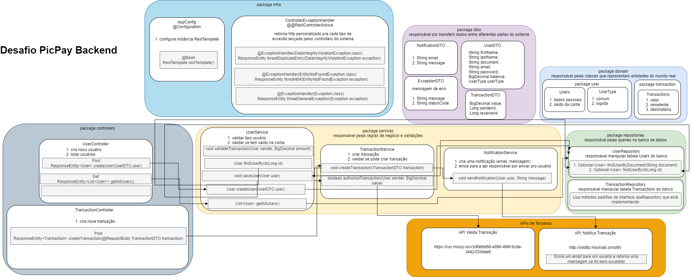
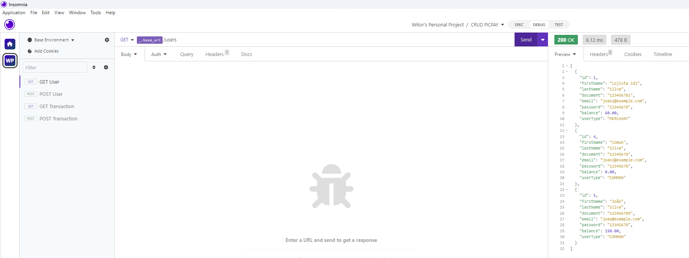
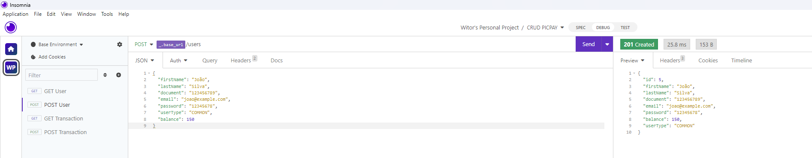
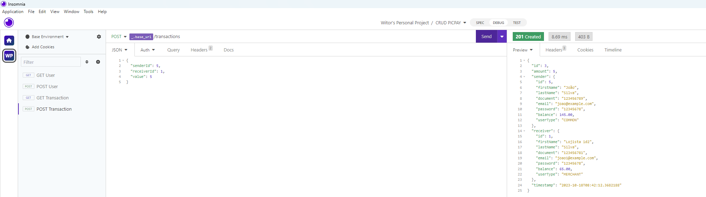
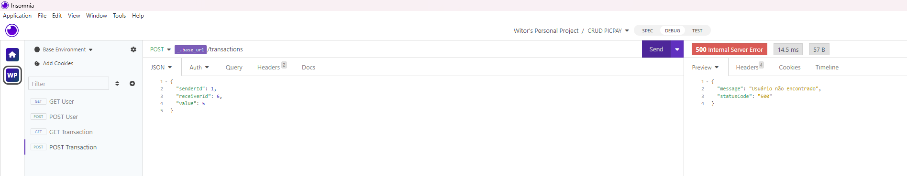
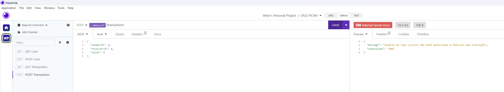

# API de Transferências Financeiras


Este projeto é uma API construída para o desafio [PicPay Simplificado](https://github.com/PicPay/picpay-desafio-backend). Utiliza **Java, Java Spring, H2 database como banco de dados em memória.**
## Sobre o Projeto

Este projeto é uma API que permite a realização de transferências financeiras entre usuários. Basicamente, é como um mini banco digital onde os usuários podem se cadastrar e transferir dinheiro uns para os outros. Ele foi desenvolvido como parte de um desafio técnico e é perfeito para entender como transações financeiras podem ser feitas de forma segura e eficiente usando Java e Spring Framework.
## Sumário

- [Visão Geral da Arquitetura](#visão-geral-da-arquitetura)
- [Instalação](#instalação)
- [Uso](#uso)
- [EndPoints da API](#endpoints-da-api)
- [Banco de Dados](#banco-de-dados)
- [Insomnia](#insomnia)

## Visão Geral da Arquitetura
 Aqui apresentamos um diagrama que esclarece a estrutura do projeto.


## Instalação

1. Clone o repositório:

```bash
git clone https://github.com/witorsather/picpay-simplificado-api.git
```

2. Instale as dependências com o Maven.

## Uso

1. Inicie a aplicação com o Maven.
2. A API estará acessível em http://localhost:8080.

## EndPoints da API
A API oferece os seguintes pontos de extremidade:

```markdown
POST /users: Cadastre um novo usuário. Enviar JSON com "name", "email" e "password".
GET /users: Obtém a lista de todos os usuários cadastrados. Não requer parâmetros.
POST /transaction: Realize uma nova transferência. Enviar JSON com "senderId", "receiverId" e "value".
```

## Banco de Dados
O projeto utiliza o [H2 Database](https://www.h2database.com/html/main.html) como banco de dados.

## Insomnia
Arquivos de configuração para testar os endpoints (pontos onde a API pode ser acessada) estão disponíveis na pasta `/utilidades`. Você pode importar esses arquivos para o Insomnia para experimentar a API.

#### Exemplos de Uso no Insomnia

- **Buscar Todos os Usuários**: Use este exemplo para saber como obter a lista de todos os usuários cadastrados.
  

- **Cadastrar Novo Usuário**: Este exemplo mostra como você pode cadastrar um novo usuário.
  

- **Realizar Nova Transferência**: Este exemplo mostra como fazer uma nova transferência entre usuários.
  

- **Usuário Não Encontrado**: Este exemplo mostra uma mensagem de erro quando o usuário não é encontrado.
  

- **Tipo Lojista**: Este exemplo mostra uma mensagem de erro quando um lojista tenta enviar dinheiro, o que não é permitido.
  


